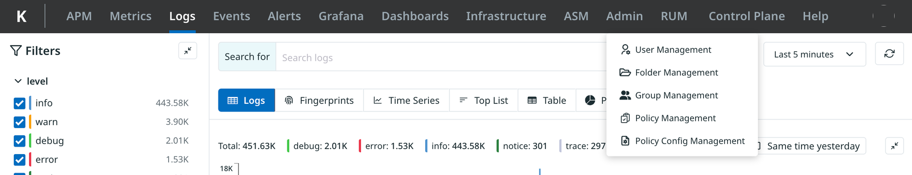

= RBAC: Using the Admin Tab
:description: Perform various RBAC workflows and configurations through the UI: managing users, user groups, folders, policies, policy configurations, and permissions.
:sectanchors:
:url-repo:  
:page-tags: RBAC, Role-Based Access Control, permissions, roles, users, groups, security, access, folders, Admin tab
:figure-caption!:
:table-caption!:
:example-caption!:

[TIP]
====
 This feature is only available in Release 2.7.3, and subsequent versions of Kloudfuse.
====

Use the Admin tab to perform the various RBAC workflows and configurations through the UI:

* xref:user-management.adoc[User Management]
* xref:folder-management.adoc[Folder Management]
* xref:group-management.adoc[Group Management]
* xref:policy-management.adoc[Policy Management]
* xref:policy-configuration-management.adoc[Policy Configuration Management]

.The Admin Tab

