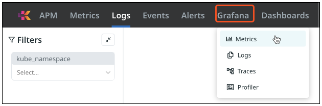

= Grafana metrics
:description: Kloudfuse includes a fully embedded Grafana metrics interface
:sectanchors:
:url-repo:
:page-tags: Kloudfuse, observability, metrics
:figure-caption!:
:table-caption!:
:example-caption!:

The Kloudfuse platform has a fully-compliant PromQL interface for exploring its metrics. This enables you to use standard open-source tools, like Grafana. Kloudfuse stack ships with a built-in Grafana server that you can access by clicking the *Grafana* tab on the top bar.

Use the Grafana service to create custom dashboards and perform _ad-hoc_ metric exploration. You can also import existing Grafana dashboards into the Kloudfuse Grafana instance.

[NOTE]
.Match scrape interval
====
Esure that the KfuseDatasource scrape interval parameter matches the actual scrape interval of the metrics data collection. Otherwise, you may get empty results.
====

Alternatively, you can configure an external Grafana application by adding the kloudfuse stack as a Prometheus data source. See xref:https://grafana.com/docs/grafana/latest/datasources/add-a-data-source/[Grafana documentation^] for details.

